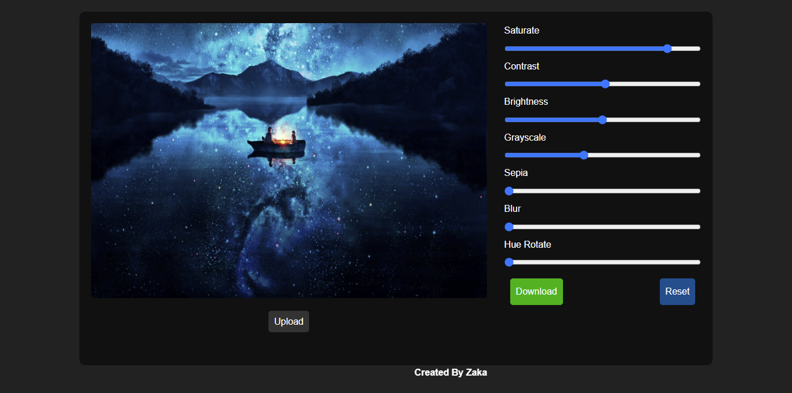

# 🖼️ JavaScript Image Editor

## 📌 Project Overview
This is a **JavaScript-based Image Editor** that allows users to **apply filters** like **saturation, contrast, brightness, grayscale, sepia, blur, and hue rotation** to their images. Users can **upload an image, edit it in real-time, reset changes, and download the final result.**  

## 🚀 Features
✅ Upload & preview images  
✅ Adjust image filters using sliders  
✅ Reset filters to default values  
✅ Download the edited image  
✅ Responsive design (Works on mobile & desktop)  

## 🎥 Demo Preview  
  

## 🌍 Live Demo  
🔗 **Try it here:** [https://unrivaled-froyo-fc33b2.netlify.app/]  

## 🛠️ Technologies Used  
- HTML5  
- CSS3 (Flexbox & Grid for layout, animations)  
- JavaScript (DOM Manipulation, FileReader API, Canvas API)  

## 🏃‍♂️ How to Run the Project  
1. **Clone this repository:**  `git clone https://github.com/ZakaDev22/ImageEditor.git`
3. **Open `index.html` in a browser**  
4. **Upload an image & start editing!** 
